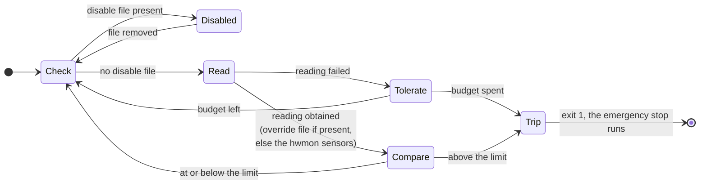

# slurm-temperature-check

Keeps a SLURM worker node from running jobs while one of its temperature
sensors is over the limit configured for its mainboard.

An unprivileged service reads the sensor from the kernel's `hwmon`
interface in sysfs once every ten seconds and exits non-zero the moment
the node must stop. systemd turns that exit into a second, privileged
unit that kills the running job steps and stops `slurmd`. Splitting it
that way is the whole design: the part that runs continuously on every
node can do nothing but read sysfs, and the part that can kill jobs is
reachable along exactly one edge, `OnFailure=`, and only for the failures
that call for killing anything.

Every failure takes the node out of service, because a temperature that
is not known is not known to be safe. How far that goes follows what the
node was promised. A sensor that cannot be read, a reading that cannot be
parsed, a check loop that stops turning: the node was being watched and
is not any more, so the job steps are killed. A guard that never armed at
all — a mainboard that is not in the table, a chip that is not present, a
bad flag — drains the node instead and leaves the jobs already running on
it alone, because a guard failing to start changed nothing about the
node's temperature.

It installs nine files:

| Installed file | Purpose |
|---|---|
| `/usr/bin/slurm-temperature-check` | The guard. Reads sysfs, compares against the board's limit, exits non-zero when the node must stop. |
| `/usr/lib/systemd/system/slurm-temperature-check.service` | Runs the guard as an unprivileged `Type=notify` service with a watchdog, and names both responses to a failure in `OnFailure=`. |
| `/usr/lib/systemd/system/slurm-temperature-check-emergency-stop.service` | Kills the SLURM job steps by cgroup and stops `slurmd`, when the guard failed while it was watching. Has no `[Install]` section: nothing but that `OnFailure=` starts it. |
| `/usr/lib/systemd/system/slurm-temperature-check-drain.service` | Drains the node, when the guard exited without ever having armed. Leaves the running job steps alone, and has no `[Install]` section either. |
| `/usr/libexec/slurm-temperature-check/failure-kind` | Decides which of those two a failure was, as the `ExecCondition=` of both. Holds no privilege, reads no configuration and kills nothing. |
| `/usr/lib/systemd/system/slurmd.service.d/temperature-check.conf` | Ordering only, so at boot the guard has taken a reading before `slurmd` accepts work. |
| `/usr/lib/sysusers.d/slurm-temperature-check.conf` | Creates the system user `slurm-temp-check`. |
| `/etc/slurm-temperature-check/boards.conf` | The board table: which sensor to watch, and how hot it may get. |
| `/etc/sysconfig/slurm-temperature-check` | `OPTIONS=` for the guard's flags. |

## Requirements

| Requirement | Detail |
|---|---|
| OS | EL9 or later (packaged and tested for Rocky Linux 9; also builds on EL10 and current Fedora). systemd 250 or later, for `systemctl kill --kill-whom=`, which EL9's 252 has. |
| Sensors | A mainboard whose temperature is exposed through the kernel's hwmon class — `coretemp`, `k10temp`, `spd5118`, a NIC's `i350bb` and so on. `lm_sensors` is **not** required: the readings come from sysfs directly, which is where `sensors` reads them from too. `sensors` remains useful for exploring a new board by hand. |
| SLURM | Any version, and it need not be installed for the package to install cleanly. Which cgroup the job steps land in does matter, and the emergency stop covers both layouts; see [How it works](#how-it-works). Draining a node needs `scontrol` in `/usr/bin` — where there is none, the drain unit is skipped rather than failed. |
| Privileges | None for the guard. The emergency stop runs as root, because stopping and killing units does. |
| SELinux | Any mode. Everything the guard reads is a world-readable sysfs attribute and no policy module ships or is needed. |

## Install

```console
# dnf install ./slurm-temperature-check-<version>-1.el9.x86_64.rpm   # from the GitHub release
```

Installing does not start anything. **Confirm the node's mainboard is in
the table before enabling the unit**: a guard that cannot resolve its
board refuses to start, and a guard that fails to start drains the node.
Nothing that is already running on it dies, but it takes no further work
until someone resumes it.

```console
# cat /sys/devices/virtual/dmi/id/board_name          # the table's section name
H12DSi-N6
# slurm-temperature-check --list                      # what this node exposes
CHIP                SENSOR  LABEL  READING
k10temp-pci-00cb    temp1   Tctl   47.250C
k10temp-pci-00cb    temp2   Tccd1  44.000C
spd5118-i2c-20-50   temp1   -      38.500C
# slurm-temperature-check --check                     # resolve the table against this node
board    H12DSi-N6
sensors  k10temp-pci-00cb/Tctl
limit    85.000C
source   k10temp-pci-00cb/Tctl
reading  47.250C
verdict  ok
```

`source` is where the reading came from, which is the sensors unless the
override file is present; see [Verifying it works](#verifying-it-works).

`--check` exits 0 only when the node would be guarded. Once it does:

```console
# systemctl enable --now slurm-temperature-check
# systemctl status slurm-temperature-check
   Active: active (running)
   Status: "Watching k10temp-pci-00cb/Tctl, limit 85.000C"
```

If `--list` shows a sensor the table does not name yet, add a section for
the board to `/etc/slurm-temperature-check/boards.conf` and send it as a
pull request, so the next node of that model works out of the box.

Where the package reaches nodes before their boards are enrolled — a base
image, a configuration-management rollout that enables units by class —
put the disable file on the ones that are not enrolled yet:

```console
# touch /etc/slurm-temperature-check/disable
```

A guard started on such a node reports itself suspended and does nothing
whatever, to the node's SLURM state included, until the file is removed;
that is specification row 13. Enrolling the node is then: add the board,
`--check`, remove the file. The cost is that the file is fail-open. A node
left with it is not guarded, and `systemctl status` and `--check` saying
so is the only thing that will point it out.

## How it works

The guard loop is one decision, taken once per `--interval`:



The guard never stops anything itself; it reports its verdict by exiting.
Exit 0 means "asked to stop" and leaves `slurmd` alone, which is why
`systemctl stop slurm-temperature-check` is safe to run at any time. Any
non-zero exit puts the unit into the failed state, and systemd starts the
two units named in `OnFailure=`. Which of them acts follows the exit
status:

| The guard exited | What that means | What runs |
|---|---|---|
| 1, or on a signal, or killed by the watchdog | It had armed: the node was being watched and is not any more | The emergency stop |
| 2 | It never armed, and never took a reading at all | The drain |

`OnFailure=` cannot branch on an exit status, so both units are started
and each one's `ExecCondition=` runs
`/usr/libexec/slurm-temperature-check/failure-kind`, which exits 0 for
the failures that are its unit's and 1 for the rest; an `ExecCondition=`
that exits 1 skips the unit without failing it. It reads the status from
the `MONITOR_EXIT_CODE` and `MONITOR_EXIT_STATUS` systemd sets in a unit
started through `OnFailure=`, and falls back to asking systemd for the
guard unit's `ExecMainCode` and `ExecMainStatus`. Anything it cannot
positively identify as an exit 2 belongs to the emergency stop, so a
failure it cannot read is a kill and never a silent nothing.

The emergency stop runs three commands in this order:

```console
# systemctl kill --signal=SIGKILL --kill-whom=all slurmstepd.scope
# systemctl kill --signal=SIGKILL --kill-whom=all slurmd.service
# systemctl stop slurmd.service
```

Job steps go first because they are the thermal load. SLURM 22.05 and
later with the cgroup/v2 plugin put each step under `slurmstepd.scope`,
deliberately outside `slurmd`'s own cgroup so that steps survive a
`slurmd` restart; older configurations leave them inside it, which the
second command covers. Killing a cgroup's whole membership is what makes
this complete and race-free: it does not matter how deeply a job nested
its processes, and `--kill-whom=all` reaches them whatever `KillMode=`
the `slurmd` unit sets — SchedMD ships `KillMode=process`, so a plain
stop would leave every job process running. `stop` comes last so the unit
ends in a stopped state, which also disarms a `Restart=` a site may have
added to `slurmd.service`.

The drain runs one:

```console
# scontrol update NodeName=$(hostname -s) State=DRAIN Reason="slurm-temperature-check: the guard could not arm"
```

The node name is systemd's `%l` specifier in the unit file, the hostname
truncated at the first dot, which is what SLURM's `NodeHostname` defaults
to; a site whose `NodeName` is something else overrides the unit with
`systemctl edit`.

Exit 2 is returned only before a single reading has been taken — a board
that is not in the table, a chip or sensor that is not present, a table
that does not parse, a bad flag in `OPTIONS=` — and never once the check
loop is running, where the only failure is exit 1. A node that exits 2 was
therefore never guarded, and the guard failing to start made it no hotter
than it was a second earlier: it was exactly as unwatched before somebody
ran `systemctl start`. What has to follow is that the scheduler stops
sending work to a node whose limit nobody knows, which is what a drain is.
Killing the jobs instead answers a missing line in a table with the
response reserved for a node that is too hot, and the hardware's own
`PROCHOT` and thermal shutdown sit underneath either response: this
package is the policy limit above them, not the last line of defence.

The drain is deliberately not undone when the board is added and the guard
arms. A node may have been drained for reasons that have nothing to do
with this package, and a thermal interlock that returns nodes to service
on its own is not one; the operator resumes it with `scontrol update
NodeName=$(hostname -s) State=RESUME`. If the drain itself fails — no
`scontrol` on the node, no route to `slurmctld` — the unit lands in the
failed state and nothing further is attempted. Stopping `slurmd` instead
would also take the node out of service, but `slurmctld` marks an
unresponsive node DOWN after `SlurmdTimeout` and kills the jobs on it,
which is the outcome the drain exists to avoid, arriving five minutes
late.

The `slurmd` drop-in this package installs carries ordering and nothing
else:

```ini
[Unit]
After=slurm-temperature-check.service
```

It is deliberately not `BindsTo=`. Binding `slurmd`'s lifecycle to the
guard means every stop of the guard takes the jobs with it, including the
stops that happen during a package upgrade or while an operator is
servicing a sensor. The coupling that matters runs the other way and only
on failure.

It is deliberately not `Wants=` either. A `Wants=` here would *start* the
guard whenever `slurmd` starts, whether or not the guard was ever
enabled — an `[Install]` section has no say over a dependency another
unit declares — so a node with the package installed but its board not
yet in the table would take itself out of the scheduler on the next
`systemctl restart slurmd` or reboot, and did kill its own jobs there
while every failure still ran the emergency stop. `After=` alone orders the two whenever both are
started, which is all this drop-in is for.

A loop that stops turning is the one failure nothing else would notice,
so the unit sets `WatchdogSec=60` and the guard's keep-alive is gated on
the loop's progress rather than sent unconditionally. A ticker pings
systemd every `WatchdogSec`/2, but only while the check loop has
completed a pass recently — "recently" being whichever is longer of two
`--interval`s and `WatchdogSec`, 60s at the defaults. A wedged loop stops
the keep-alive, systemd kills the service one `WatchdogSec` later, the
unit lands in failed, and the emergency stop runs — the same path as any
other failure. Wedge to kill is therefore between one and two
`WatchdogSec`, about 60 to 120 seconds as shipped.

### Expected behaviour

The table below is the specification. Rows 1 to 10 are `TestTruthTable` in
`internal/guard/guard_test.go`, row for row; rows 11 to 13 are
`TestCannotArm`, `TestDisableFileOutranksArming` and
`TestRearmWhenResumed` in `cmd/slurm-temperature-check/main_test.go`,
because refusing to start is the command's decision rather than the
loop's. Which of the two responses an outcome gets is decided by the exit
status and pinned by `TestExitCodeSeparatesArmingFromTripping` beside
them.

| # | Disable file | Override file | Sensors | Outcome |
|---|---|---|---|---|
| 1 | present | any | any | keep running, no reading taken |
| 2 | absent | present, unreadable | any | tolerate, then stop |
| 3 | absent | present, not a number | any | tolerate, then stop |
| 4 | absent | present, empty | any | tolerate, then stop |
| 5 | absent | present, above the limit | any | stop |
| 6 | absent | present, at or below the limit | any | keep running |
| 7 | absent | absent | unreadable | tolerate, then stop |
| 8 | absent | absent | not a number | tolerate, then stop |
| 9 | absent | absent | above the limit | stop |
| 10 | absent | absent | at or below the limit | keep running |
| 11 | absent | absent | board not in the table | refuse to start, drain the node |
| 12 | absent | absent | configured chip or sensor absent | refuse to start, drain the node |
| 13 | present | any | anything rows 11 and 12 would refuse to start for | keep running, no reading taken |

"Stop" in the Outcome column is the emergency stop: the job steps are
killed and `slurmd` is stopped. Rows 11 and 12 are the other response,
where the node is drained and what is running on it is left to finish.
Both take the node out of service; only one of them costs the work in
flight.

Row 13 is row 1 applied to a node that cannot be guarded at all. Refusing
to start exits non-zero, which fails the unit exactly as a trip does, so
a node whose board is missing from the table would otherwise drain itself
on every start and every reboot — and the disable file, the documented
way to take a node out of the mechanism, could not stop it. While the
file is present the guard waits instead, logs why it cannot arm, and arms
itself within one interval of the file being removed.

"Tolerate, then stop" is `--read-retries` consecutive failures absorbed
and the next one fatal. At the default of two failures and a ten second
interval, a sensor that has genuinely gone away stops the node within
about thirty seconds, which is far inside any thermal time constant,
while a single bad read does not kill a three-day job. The counter resets
on the first good reading. Set `--read-retries=0` for a site that prefers
the strictest possible guard.

The limit is inclusive and the comparison is exact. Readings are kept in
the millidegrees the kernel reports, so against a limit of 85 a reading
of 85.000 °C keeps running and 85.001 °C stops.

## Configuration

`/etc/slurm-temperature-check/boards.conf` holds one section per
mainboard, its header matched against the DMI board name:

```ini
[H12DSi-N6]
chip = k10temp-pci-00cb
sensor = Tctl
max_celsius = 85
```

| Key | Meaning |
|---|---|
| `chip` | Which hwmon chips to read. A full name as `--list` prints it (`k10temp-pci-00cb`, one chip) or a bare driver prefix (`k10temp`, every chip of that driver). The prefix form watches all sockets of a multi-socket node and compares the hottest of them. Required. |
| `sensor` | A driver label (`Tctl`, matched without regard to case) or an attribute name (`temp1`). Omitted, it selects the lowest-numbered temperature attribute of each matched chip, which is the first reading `sensors` prints for that chip. |
| `max_celsius` | The limit, in degrees Celsius. Fractions are allowed. Required. |

The parser is strict on purpose. An unknown key, a repeated section, a
repeated key, a missing threshold and a threshold outside 20–150 °C are
all errors rather than defaults, because every one of them would
otherwise produce a node that looks guarded and is not — a misspelled
`sensr =` would silently fall back to a different sensor, and
`max_celsius = 850` is a guard that never fires.

Flags go in `OPTIONS=` in `/etc/sysconfig/slurm-temperature-check`:

| Flag | Default | Purpose |
|---|---|---|
| `--interval` | `10s` | Delay between checks |
| `--read-retries` | `2` | Consecutive failed readings tolerated before stopping |
| `--config` | `/etc/slurm-temperature-check/boards.conf` | Board table |
| `--disable-file` | `/etc/slurm-temperature-check/disable` | While present, checking is suspended |
| `--override-file` | `/run/slurm-temperature-check/override` | While present, read instead of the sensors |
| `--hwmon.path` | `/sys/class/hwmon` | sysfs hwmon class directory |
| `--board-name-path` | `/sys/devices/virtual/dmi/id/board_name` | Where the DMI board name is read from |
| `--log.level` | `info` | `debug`, `info`, `warn`, `error` |
| `--log.format` | `text` | `text` or `json` |
| `--list` | | Print the node's sensors and exit |
| `--check` | | Resolve the table against this node, take one reading, exit |
| `--version` | | Print the version and exit |

Raising `--interval` needs no matching change to `WatchdogSec=`: the
staleness window the guard applies is already the longer of two intervals
and `WatchdogSec`. Raising `WatchdogSec=` with `systemctl edit
slurm-temperature-check.service` only makes a wedged loop take longer to
notice.

### Suspending the guard

Creating the disable file suspends checking within one interval, without
touching the unit, its enabled state, the configuration or this program:

```console
# touch /etc/slurm-temperature-check/disable
```

It lives on a persistent filesystem on purpose, so that a node taken out
of the mechanism stays out across a reboot. The guard keeps running and
reports it, so a node left disabled is visible rather than silent:

```console
# systemctl status slurm-temperature-check
   Active: active (running)
  ... slurm-temperature-check[811]: WARN checking suspended: the disable file is present
```

Remove the file to re-arm, again within one interval.

## Verifying it works

Nothing about a safety mechanism should be taken on trust, and the
override file exists so the whole path can be exercised on a live node.
While it is present it is read instead of the hardware, so a value above
the board's limit drives the mechanism exactly as real heat would.

**Drain the node first.** This kills the jobs on it.

```console
# scontrol update NodeName=$(hostname -s) State=DRAIN Reason="temperature-check test"
# echo 25 > /run/slurm-temperature-check/override    # a plausible reading: nothing happens
# systemctl status slurm-temperature-check           # still active (running)
   Status: "Watching /run/slurm-temperature-check/override, limit 85.000C"
  ... WARN the override file is being read in place of the sensors reading=25.000C ...
# echo 999 > /run/slurm-temperature-check/override   # over every limit
```

Taking the override into use is logged and changes the status line, so a
node left with one afterwards is visible rather than silently reporting a
number somebody typed. `--check` names it as the `source` too.

Within one interval:

```console
# systemctl status slurm-temperature-check
   Active: failed (Result: exit-code)
  ... ERROR guard tripped, the node must stop running jobs reason="999.000C exceeds the 85.000C limit of board H12DSi-N6"
# systemctl status slurmd
   Active: inactive (dead)
# journalctl -u slurm-temperature-check-emergency-stop
```

Then remove the override, start the guard again and return the node:

```console
# rm /run/slurm-temperature-check/override
# systemctl start slurm-temperature-check slurmd
# scontrol update NodeName=$(hostname -s) State=RESUME
```

The other response needs no heat at all, only a guard that cannot arm.
**This one leaves `slurmd` and the running job steps alone**, that being
the property under test, so it can be run on a node with work on it:

```console
# mv /etc/slurm-temperature-check/boards.conf{,.away}
# systemctl restart slurm-temperature-check
Job for slurm-temperature-check.service failed because the control process exited with error code.
# systemctl status slurm-temperature-check
   Active: failed (Result: exit-code)
  ... ERROR cannot arm the guard error="open board table /etc/slurm-temperature-check/boards.conf: no such file or directory"
# journalctl -u slurm-temperature-check-drain -n 5
  ... slurm-temperature-check.service exited 2 without ever taking a reading: draining this node, its running job steps are left alone
# sinfo -n $(hostname -s) -o '%T %E'
  drained slurm-temperature-check: the guard could not arm
# systemctl status slurmd                        # untouched: active (running)
# systemctl status slurm-temperature-check-emergency-stop
   Active: inactive (dead)
   Condition: start condition unmet
```

The emergency stop sitting there with its condition unmet is what "the
jobs were left alone" looks like from the outside: it was started, it
asked which kind of failure this was, and it stood down. Put the table
back, start the guard and return the node:

```console
# mv /etc/slurm-temperature-check/boards.conf{.away,}
# systemctl start slurm-temperature-check
# scontrol update NodeName=$(hostname -s) State=RESUME
```

## Security model

The guard runs as `slurm-temp-check`, an unprivileged system user with no
home, no shell and no group memberships. Everything it reads — the hwmon
attributes, the DMI board name, its own configuration — is world-readable
already, so it holds no privilege that anything else on the node does
not. Its unit has an empty `CapabilityBoundingSet=`, no network
(`PrivateNetwork=yes`, `RestrictAddressFamilies=AF_UNIX` for the notify
socket alone), no devices, a read-only view of the filesystem apart from
its runtime directory, and a system-call filter. `systemd-analyze
security` scores it inside systemd's "OK" band, and CI fails if a
hardening directive is dropped.

The privileged half is two units,
`slurm-temperature-check-emergency-stop.service` and
`slurm-temperature-check-drain.service`. Both run as root — stopping and
killing units does, and so does draining a node — and both are reachable
along exactly one edge: neither has an `[Install]` section, nothing
`Wants=` or `Requires=` either of them, and only the guard's `OnFailure=`
names them. Their commands are fixed in the unit files — no argument
comes from the configuration, from the sensors or from anything else that
could be influenced, and the node name the drain passes to `scontrol` is
systemd's own `%l` specifier — so the worst a corrupted board table can
do is refuse to arm, never widen what gets killed.

Deciding between the two takes exactly one input, the exit status of the
guard's own unit as systemd reports it, and that decision is the whole of
`/usr/libexec/slurm-temperature-check/failure-kind`: it runs as the
`ExecCondition=` of both units, holds no privilege, opens no file, and
executes nothing but a `systemctl show` when systemd has not already put
the status in its environment.

The two are not sandboxed alike. The emergency stop needs systemd's
private D-Bus socket and nothing else, so it keeps `PrivateNetwork=yes`,
`RestrictAddressFamilies=AF_UNIX` and an empty `CapabilityBoundingSet=`.
The drain has to reach `slurmctld` across the network and authenticate to
it, so it has none of those three; deciding on a site's behalf what its
own `slurm.conf` and auth plugin may reach is not something this package
can do from here. That is the price of the response that kills nothing.

The DMI attributes next to `board_name` that are *not* world-readable
(`board_serial`, `product_uuid`, mode 0400) are deliberately never
touched.

## Troubleshooting

| Symptom | Likely cause | Check |
|---|---|---|
| `systemctl start` fails immediately and the node is drained | The guard could not arm: the board is not in the table, or the configured chip or sensor is not present. The jobs that were running are untouched | `journalctl -u slurm-temperature-check -n 20` names which; `slurm-temperature-check --list` shows what the node actually has, and `--check` resolves the table against it |
| A node is drained with `Reason=slurm-temperature-check: the guard could not arm` | The same thing, as the scheduler sees it. It is not undone when the board is added: a node can be drained for reasons that are none of this package's business | Fix what `journalctl -u slurm-temperature-check` reports, `--check`, start the guard, then `scontrol update NodeName=$(hostname -s) State=RESUME` |
| `slurm-temperature-check-drain.service` is in the failed state | The drain was attempted and did not work: no route to `slurmctld`, authentication, or a `NodeName` that is not this node's short hostname | `journalctl -u slurm-temperature-check-drain`; `scontrol show node $(hostname -s)`. A site whose `scontrol` is not in `/usr/bin`, or whose `NodeName` differs, overrides the unit with `systemctl edit`. The node is unguarded meanwhile |
| `cannot arm the guard ... is not in the table` | A model whose board name is not a section header yet | `cat /sys/devices/virtual/dmi/id/board_name`, then add the section; the message lists every board the table does know |
| `no hwmon chip matches "k10temp-pci-00c3"` | The chip moved to a different PCI function or i2c bus, usually after a firmware or kernel change | `slurm-temperature-check --list`; either pin the new full name or use the bare driver prefix (`k10temp`), which matches whatever address it lands on |
| `chip "..." has no sensor "Tdie"` | The driver renamed or dropped the label | The message lists the chip's available attributes and labels; `sensors` shows the same names |
| The node stops with `... is not an integer` or `read ...: input/output error` | A sensor that has genuinely gone away, or a bus that is wedged | `journalctl -u slurm-temperature-check`; the warnings before the stop show how many readings failed first. `--read-retries` raises the tolerance, but a sensor that never comes back should be replaced in the table, not tolerated |
| The unit is killed with `Watchdog timeout` | The check loop stopped making progress | `journalctl -u slurm-temperature-check`; a keep-alive is withheld only once no pass has completed for the longer of two `--interval`s and `WatchdogSec` (60s as shipped), and the guard logs that before systemd acts |
| `systemctl stop slurmd` also kills the guard, or vice versa | A leftover `BindsTo=` from an earlier setup | `systemctl cat slurmd.service` — the drop-in this package installs carries `After=` only; remove any local override that adds `BindsTo=` or `Wants=` |
| Jobs survived a trip | `slurmstepd.scope` does not exist and the steps are not in `slurmd`'s cgroup either | `systemd-cgls -u slurmd.service` and `systemctl status slurmstepd.scope` while a job runs, to see where the steps actually land; `journalctl -u slurm-temperature-check-emergency-stop` shows what the three commands reported |
| `slurmd` came back by itself after a trip | `Restart=` on `slurmd.service`, winning a race against the final `stop` | `systemctl show -p Restart slurmd.service`; the node is drained by `slurmctld` regardless, but consider removing `Restart=` |
| A guard that cannot arm kills the jobs instead of draining the node | A systemd too old for `ExecCondition=`, or units and classifier out of step after a partial upgrade | `systemctl cat slurm-temperature-check-emergency-stop` shows the `ExecCondition=`; `journalctl -u slurm-temperature-check-emergency-stop` carries the line naming which kind of failure it acted on |
| Nothing happens on a node that should be guarded | The unit is not enabled, or the disable file is there | `systemctl is-enabled slurm-temperature-check`; `ls /etc/slurm-temperature-check/disable` |
| Readings differ from `sensors` | A different attribute of the same chip | `slurm-temperature-check --list` prints the attribute and label of every reading; the default is the chip's lowest-numbered attribute |

## Uninstall

```console
# dnf remove slurm-temperature-check
```

The unit is stopped and disabled first, so removal does not trip the
guard. A running `slurmd` is untouched: the drop-in goes away with the
package, and it never coupled `slurmd`'s lifecycle to anything. An
unmodified `boards.conf` is removed with the package; a modified one is
kept as `.rpmsave`, as `%config(noreplace)` files always are. The
`slurm-temp-check` user is left in place, as system users created by
sysusers.d always are; `userdel slurm-temp-check` removes it.

## Alternatives considered

| Approach | Verdict |
|---|---|
| One response to every failure: kill the job steps whatever the guard exited with | How this began, and the simpler invariant to state. It answers a deployment mistake — a board missing from the table, a typo in a `boards.conf` pushed by configuration management — with the response reserved for a node that is too hot, on a node whose temperature nobody had promised to watch in the first place. Worse, that mistake is correlated across a fleet where a thermal trip is not: one bad table plus a rollout that restarts units is every node killing its jobs at once. The exit status already distinguished the two cases; only the units did not. |
| `BindsTo=slurm-temperature-check.service` on `slurmd.service` | The obvious spelling, and how this mechanism began. It couples the lifecycles in both directions: every stop of the guard stops `slurmd` and kills the jobs, including during a package upgrade or a sensor repair, and `systemctl restart slurmd` becomes impossible without losing the workload. `OnFailure=` couples only the one direction that matters. |
| Killing job processes by PID (`pgrep` / `pstree`) | What the internal predecessor did. `pstree -p` truncates its output at the terminal width unless given `-l`, so a job tree wider than that yields truncated PIDs — and a truncated PID is a real, unrelated process that then gets `SIGKILL`. Collecting PIDs and killing them later is racy besides. Cgroup membership is exact, complete and needs no `psmisc`. |
| `echo 1 > /sys/fs/cgroup/.../cgroup.kill` | Strictly the most thorough: the kernel kills the whole subtree atomically, including processes that fork during the kill (Linux 5.14+, so EL9 has it). It needs the package to know SLURM's cgroup layout, which varies with the plugin and the SLURM version, where `systemctl kill` asks systemd for the same thing by unit name. Worth revisiting if a layout is ever found that `--kill-whom=all` does not cover. |
| A separate reader process writing the temperature to a file in `/run` | The internal predecessor's design. The split buys nothing once the reader is a sysfs read rather than a subprocess, and it costs a whole class of problems that exist only because of the file: partial reads, atomic-write handling, error strings landing in the file where a number was expected, and a staleness check to notice that the writer died. `WatchdogSec=` answers the last one properly, and the rest disappear. |
| Shelling out to `sensors` and parsing its output | Needs `lm_sensors` installed, a subprocess and a timeout per reading, and a regular expression over human-readable output that changes between driver versions. `sensors` reads the same sysfs attributes this program reads. |
| Reading the driver's own `tempN_crit` / `tempN_max` limits instead of a table | Tempting, and wrong for this purpose: those are the hardware's shutdown thresholds. A site's limit is an operational decision, usually well below them, and it differs between two nodes with the same chip. |
| `systemd.timer` plus a oneshot script | No long-lived process to watch, but also no watchdog, a fresh process per check, and the failure semantics have to be rebuilt on top of the timer. The running cost of one sleeping process per node is negligible. |

## Verified interface facts

Recorded here so operators and reviewers do not need to re-derive them.
Re-verify against the versions actually deployed.

- hwmon: `tempN_input` is the temperature in millidegrees Celsius and
  `tempN_label` its optional name, both mode 0444
  (`Documentation/hwmon/sysfs-interface.rst`). `/sys/class/hwmon/hwmonN`
  is a symlink to the device's `hwmon` directory; `device` inside it
  points back at the parent that owns the sensors, and that parent's
  `subsystem` symlink names its bus. That parent is not always a bus
  device: a driver may register its hwmon device below a class device —
  `nvme` below `/sys/class/nvme`, an ACPI thermal zone below
  `/sys/class/thermal` — whose `subsystem` names the class instead. Each
  such device carries a `device` link of its own, and the chain has to be
  followed until it reaches a bus.
- libsensors composes a chip name from the driver's `name` attribute plus
  the bus and address of that device (`lib/sysfs.c`, `lib/access.c`):
  `%s-i2c-%d-%02x` with a decimal bus and hex address; `%s-pci-%04x` with
  the address folded from the BDF as `(bus << 8) | (slot << 3) | func`,
  which is why k10temp at `0000:00:18.3` is `k10temp-pci-00c3` and a GPU
  at `0000:04:00.0` is `amdgpu-pci-0400`; `%s-acpi-%x` for ACPI devices,
  which have one address rather than a foldable one, so an ACPI thermal
  zone is `acpitz-acpi-0`; and `%s-isa-%04x` for platform devices, whose
  address is the id after the dot in the device name, so a dual-socket
  node shows `coretemp-isa-0000` and `coretemp-isa-0001`. Dropping the
  bus from the PCI address, or stopping at the first `device` link, makes
  distinct devices compose one name. This program reproduces the naming
  as a convenience and only for these buses; `--list` prints what it
  actually computed on the node, which is authoritative.
- DMI: `/sys/devices/virtual/dmi/id/board_name` is the SMBIOS type 2
  "base board product name", mode 0444. `board_serial` and `product_uuid`
  beside it are 0400.
- systemd: `OnFailure=` starts its units when the unit enters the failed
  state, which a non-zero exit does and a clean `stop` does not. It takes
  a list, and it cannot branch: every unit named is started for every
  failure. `ExecCondition=` is what turns that back into a branch — exit
  0 runs the unit, 1 to 254 skips it *without* failing it, and 255 or an
  abnormal exit fails it. A unit started through `OnFailure=` is given
  `MONITOR_SERVICE_RESULT`, `MONITOR_EXIT_CODE`, `MONITOR_EXIT_STATUS`,
  `MONITOR_INVOCATION_ID` and `MONITOR_UNIT` when it is `Type=oneshot`
  (v249 and later; EL9 ships 252). `MONITOR_EXIT_CODE` is `exited`,
  `killed` or `dumped`, where `systemctl show -P ExecMainCode` reports
  the raw `si_code` — 1, 2, 3 for the same three — and the distinction
  matters, because a process killed by `SIGINT` reports status 2 as well.
  `%l` is the hostname truncated at the first dot.
  `systemctl kill --kill-whom=all` signals every process in a unit's
  cgroup regardless of the unit's `KillMode=`; the option was spelled
  `--kill-who` before v250 and EL9 ships 252. `Type=notify` with
  `WatchdogSec=` sets `WATCHDOG_USEC` and `NOTIFY_SOCKET` in the service's
  environment, and sd_notify(3) documents pinging at half the interval.
- SLURM: SchedMD's `slurmd.service` sets `KillMode=process`, so stopping
  the unit deliberately leaves job processes running. From 22.05, with
  the cgroup/v2 plugin, `slurmd` asks systemd over D-Bus for a
  `slurmstepd.scope` and moves each step into it, outside `slurmd`'s own
  cgroup, so steps survive a `slurmd` restart. Which of the two layouts a
  node uses is worth confirming with `systemd-cgls -u slurmd.service`
  while a job runs; the emergency stop covers both. A drained node
  finishes the jobs it has and is given no new ones, where a node whose
  `slurmd` has stopped answering is marked DOWN after `SlurmdTimeout`
  (300s by default) and has its jobs killed with it — which is why the
  response to a guard that never armed is the first and not the second.
  `scontrol update NodeName=... State=DRAIN` requires a `Reason=`, and
  `NodeName` is SLURM's name for the node, which defaults to its short
  hostname but need not be it.

## AI usage disclosure

This project was developed with the help of an AI coding assistant,
Anthropic's Claude. Packaging, CI and documentation were drafted with it
and are reviewed and tested by the maintainers before they are committed.
Commit messages carry no AI attribution by project policy (see
[CONTRIBUTING.md](CONTRIBUTING.md)); this section is the project-level
disclosure instead.

## Contributing

See [CONTRIBUTING.md](CONTRIBUTING.md), in particular the Conventional
Commits requirement, the self-contained-commit-message rule and the
signed-commit, fast-forward merge policy. Licensed under
[Apache-2.0](LICENSE); see [NOTICE](NOTICE).
